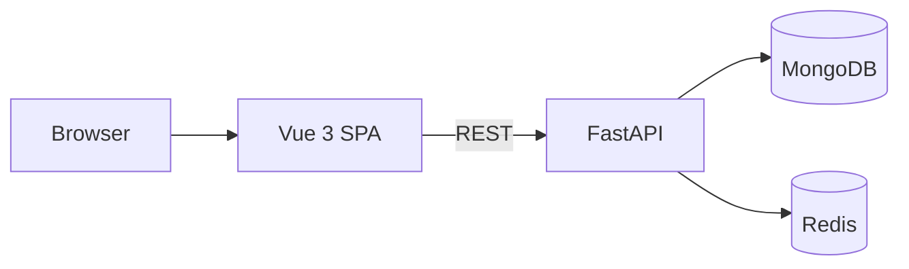

# QBIQ Dig Store — Mini E-Commerce Platform

Full-stack digital products shop with a **FastAPI** backend, **Vue 3** frontend, **MongoDB** persistence, **Redis** caching and cart sessions, and **Docker Compose** for local deployment.

## Architecture



- **Products** — stored in MongoDB, auto-seeded from `backend/data/products.json`
- **Product cache** — Redis TTL cache for list/detail responses
- **Cart** — Redis session storage keyed by `X-Cart-Session-Id` header
- **Frontend** — Vue 3 + TypeScript + Pinia + PrimeVue (Aura/Sky theme)

## Prerequisites

| Tool | Version |
|------|---------|
| Node.js | 24+ |
| Python | 3.12+ |
| Docker & Docker Compose | v2+ |

## Quick start (Docker Compose)

Run the full stack with one command:

```bash
docker compose up --build
```

| Service | URL |
|---------|-----|
| App (via gateway) | http://localhost |
| Backend API | http://localhost/api |
| Backend API (direct) | http://localhost:8000 |
| API docs (Swagger) | http://localhost/docs |
| Health check | http://localhost/health |

Stop and remove containers:

```bash
docker compose down
```

Remove persisted MongoDB data:

```bash
docker compose down -v
```

### Dev override (hot reload)

For backend `--reload` and Vite dev server on port 5173:

```bash
docker compose -f docker-compose.yml -f docker-compose.dev.yml up --build
```

App: http://localhost (gateway) or http://localhost:5173 (Vite direct)

## Local development (without Docker)

### 1. Start MongoDB and Redis

```bash
docker run -d --name qbiq-dig-store-mongo -p 27017:27017 mongo:8.0.4-noble
docker run -d --name qbiq-dig-store-redis -p 6379:6379 redis:8.0.2-alpine
```

### 2. Backend

```bash
cd backend
python3.12 -m venv .venv
source .venv/bin/activate
pip install -r requirements-dev.txt
uvicorn app.main:app --reload --port 8000
```

### 3. Frontend

```bash
cd frontend
cp .env.example .env
npm ci
npm run dev
```

App: http://localhost:5173

## GitHub Pages (frontend hosting)

The frontend can be deployed to **GitHub Pages** as a static SPA. The backend still runs separately (Docker Compose locally, or any HTTPS host).

### One-time GitHub setup

1. In the repo on GitHub: **Settings → Pages → Build and deployment → Source: Deploy from a branch**
2. Branch: `gh-pages` / root (created automatically by the deploy script below)

### Configure API URL

Edit `frontend/.env.pages` before deploying:

| Variable | Purpose |
|----------|---------|
| `VITE_BASE_PATH` | `/qbiq/` for `https://xaracal.github.io/qbiq/` |
| `VITE_API_BASE_URL` | Full URL to your backend API (must be **HTTPS** when the site is served over HTTPS) |

For local Docker backend exposed on port 8000, use a tunnel (e.g. [ngrok](https://ngrok.com/)) and set `VITE_API_BASE_URL` to the tunnel URL + `/api`. Add that origin to backend `CORS_ORIGINS`.

### Deploy manually (no CI/CD)

```bash
cd frontend
npm ci
npm run deploy:pages
```

This builds with `pages` mode, adds `404.html` + `.nojekyll` for SPA routing, and pushes `dist/` to the `gh-pages` branch.

Live site: **https://xaracal.github.io/qbiq/**

> **Tip:** For demos, Docker Compose at http://localhost is the simplest full-stack experience. GitHub Pages showcases the hosted frontend; pair it with a reachable API URL for live data.

## Network resilience

The frontend handles unreliable connections:

| Feature | Description |
|---------|-------------|
| Offline banner | Shown when the browser or API is unreachable |
| Reconnect banner | Confirms when connectivity returns and data refreshes |
| GET retries | Product reads retry up to 2 times with exponential backoff |
| Mutation retries | Cart/checkout requests retry once on network failure |
| Optimistic rollback | Cart UI reverts if an update fails after local changes |
| Auto-refresh | Cart and failed product lists reload when connection is restored |

## Running tests

### Backend

```bash
cd backend
source .venv/bin/activate
pip install -r requirements-dev.txt
pytest tests/ -v --ignore=tests/test_products_integration.py
```

Integration tests (require MongoDB):

```bash
pytest tests/test_products_integration.py -v
```

### Frontend

```bash
cd frontend
npm ci
npm test
```

## API reference

All cart and checkout endpoints require the `X-Cart-Session-Id` header (UUID generated by the frontend).

| Method | Path | Description |
|--------|------|-------------|
| `GET` | `/health` | MongoDB + Redis health |
| `GET` | `/api/products` | List products (`name`, `category`, `sort_by`, `sort_order`) |
| `GET` | `/api/products/{id}` | Product detail with reviews |
| `GET` | `/api/cart` | Get cart |
| `POST` | `/api/cart/items` | Add item `{ productId, quantity }` |
| `PATCH` | `/api/cart/items/{id}` | Update quantity `{ quantity }` |
| `DELETE` | `/api/cart/items/{id}` | Remove item |
| `DELETE` | `/api/cart` | Clear cart without placing an order |
| `POST` | `/api/checkout` | Mock checkout — persist order, clear cart |
| `GET` | `/api/orders/{id}` | Get order (session must match) |

Interactive docs: http://localhost/docs (via gateway) or http://localhost:8000/docs (direct)

## Environment variables

### Backend (`backend/.env`)

| Variable | Default | Description |
|----------|---------|-------------|
| `MONGODB_URL` | `mongodb://localhost:27017` | MongoDB connection string |
| `MONGODB_DB_NAME` | `qbiq_dig_store` | Database name |
| `REDIS_URL` | `redis://localhost:6379` | Redis connection string |
| `CACHE_TTL_SECONDS` | `300` | Product cache TTL |
| `CART_SESSION_TTL_SECONDS` | `86400` | Cart session TTL (24h) |
| `CORS_ORIGINS` | see `config.py` | JSON list of allowed origins |

### Frontend

| File | Use |
|------|-----|
| `frontend/.env` | Local dev (`npm run dev`) |
| `frontend/.env.pages` | GitHub Pages build (`npm run build:pages`) |

| Variable | Default | Description |
|----------|---------|-------------|
| `VITE_API_BASE_URL` | `http://localhost:8000/api` | Backend API base URL |
| `VITE_BASE_PATH` | `/` (dev) or `/qbiq/` (Pages) | Vite public base path |

## Project structure

```
qbiq-dig-store/
├── backend/                 # FastAPI + Beanie + Redis
├── frontend/                # Vue 3 + Vite + Pinia
├── deploy/                  # nginx gateway configs for Docker Compose
├── docker-compose.yml       # Full stack (mongo, redis, backend, frontend, gateway)
├── docker-compose.dev.yml   # Hot-reload override
└── README.md
```

## License

Private — home assignment project.
