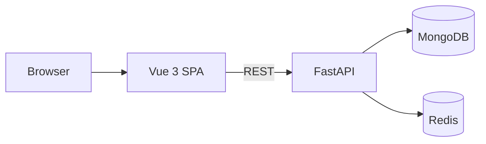
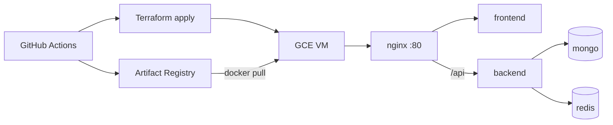

# QBIQ — Mini E-Commerce Platform

Full-stack digital products shop with a **FastAPI** backend, **Vue 3** frontend, **MongoDB** persistence, **Redis** caching and cart sessions, and **Docker Compose** for local deployment.

## Architecture



- **Products** — stored in MongoDB, auto-seeded from `backend/data/products.json`
- **Product cache** — Redis TTL cache for list/detail responses
- **Cart** — Redis session storage keyed by `X-Cart-Session-Id` header
- **Frontend** — Vue 3 + TypeScript + Pinia + shadcn-vue (Sky theme)

## Prerequisites

| Tool | Version |
|------|---------|
| Node.js | 24+ |
| Python | 3.12+ |
| Docker & Docker Compose | v2+ |

## Quick start (Docker)

Run the full stack with one command:

```bash
docker compose up --build
```

| Service | URL |
|---------|-----|
| Frontend | http://localhost |
| Backend API | http://localhost:8000 |
| API docs (Swagger) | http://localhost:8000/docs |
| Health check | http://localhost:8000/health |

Stop and remove containers:

```bash
docker compose down
```

Remove persisted MongoDB data:

```bash
docker compose down -v
```

### Dev override (hot reload)

For backend `--reload` and Vite dev server on port 5173:

```bash
docker compose -f docker-compose.yml -f docker-compose.dev.yml up --build
```

App: http://localhost:5173

## Local development (without Docker)

### 1. Start MongoDB and Redis

```bash
docker run -d --name qbiq-mongo -p 27017:27017 mongo:8.0.4-noble
docker run -d --name qbiq-redis -p 6379:6379 redis:8.0.2-alpine
```

### 2. Backend

```bash
cd backend
python3.12 -m venv .venv
source .venv/bin/activate
pip install -r requirements-dev.txt
uvicorn app.main:app --reload --port 8000
```

### 3. Frontend

```bash
cd frontend
cp .env.example .env
npm ci
npm run dev
```

App: http://localhost:5173

## Running tests

### Backend

```bash
cd backend
source .venv/bin/activate
pip install -r requirements-dev.txt
pytest tests/ -v --ignore=tests/test_products_integration.py
```

Integration tests (require MongoDB):

```bash
pytest tests/test_products_integration.py -v
```

### Frontend

```bash
cd frontend
npm ci
npm test
```

## API reference

All cart endpoints require the `X-Cart-Session-Id` header (UUID generated by the frontend).

| Method | Path | Description |
|--------|------|-------------|
| `GET` | `/health` | MongoDB + Redis health |
| `GET` | `/api/products` | List products (`name`, `category`, `sort_by`, `sort_order`) |
| `GET` | `/api/products/{id}` | Product detail with reviews |
| `GET` | `/api/cart` | Get cart |
| `POST` | `/api/cart/items` | Add item `{ productId, quantity }` |
| `PATCH` | `/api/cart/items/{id}` | Update quantity `{ quantity }` |
| `DELETE` | `/api/cart/items/{id}` | Remove item |
| `DELETE` | `/api/cart` | Clear cart (mock checkout) |

Interactive docs: http://localhost:8000/docs

## Environment variables

### Backend (`backend/.env`)

| Variable | Default | Description |
|----------|---------|-------------|
| `MONGODB_URL` | `mongodb://localhost:27017` | MongoDB connection string |
| `MONGODB_DB_NAME` | `qbiq` | Database name |
| `REDIS_URL` | `redis://localhost:6379` | Redis connection string |
| `CACHE_TTL_SECONDS` | `300` | Product cache TTL |
| `CART_SESSION_TTL_SECONDS` | `86400` | Cart session TTL (24h) |
| `CORS_ORIGINS` | see `config.py` | JSON list of allowed origins |

### Frontend (`frontend/.env`)

| Variable | Default | Description |
|----------|---------|-------------|
| `VITE_API_BASE_URL` | `http://localhost:8000` | Backend API base URL |

## Pinned versions

Bump versions intentionally via commit — never rely on floating tags in production.

### Docker images

| Service | Image |
|---------|-------|
| Backend | `python:3.12.8-slim-bookworm` |
| Frontend build | `node:24.11.0-bookworm-slim` |
| Frontend serve | `nginx:1.28.0-alpine` |
| MongoDB | `mongo:8.0.4-noble` |
| Redis | `redis:8.0.2-alpine` |

### Key Python packages (`backend/requirements.txt`)

| Package | Version |
|---------|---------|
| fastapi | 0.136.1 |
| pydantic | 2.13.4 |
| beanie | 2.1.0 |
| pymongo | 4.12.0 |
| redis | 5.2.1 |

### Key npm packages (`frontend/package.json`)

| Package | Version |
|---------|---------|
| vue | 3.5.40 |
| vite | 8.2.0 |
| pinia | 4.0.2 |
| axios | 1.19.0 |
| tailwindcss | 4.3.3 |
| shadcn-vue | 2.8.1 |

## Project structure

```
qbiq/
├── backend/                 # FastAPI + Beanie + Redis
├── frontend/                # Vue 3 + Vite + Pinia
├── terraform/               # GCE VM + firewall + IAM
├── deploy/                  # Production nginx gateway + deploy scripts
├── .github/workflows/       # CI and deploy pipelines
├── docker-compose.yml       # Local full stack
├── docker-compose.dev.yml   # Hot-reload override
├── docker-compose.prod.yml  # Production (VM / GAR images)
└── README.md
```

## GCP deployment

Production runs on a **GCE VM** provisioned by Terraform. GitHub Actions builds images, pushes to **Artifact Registry**, and deploys via SSH + Docker Compose.



### One-time GCP setup

1. Create a GCP project with billing enabled.
2. Enable APIs: **Compute Engine**, **Artifact Registry**, **IAM**.
3. Create an Artifact Registry repository:
   ```bash
   gcloud artifacts repositories create qbiq \
     --repository-format=docker \
     --location=us-central1
   ```
4. Create a GCS bucket for Terraform state:
   ```bash
   gsutil mb -l us-central1 gs://YOUR_PROJECT_ID-terraform-state
   ```
5. Create a deployer service account with roles:
   - `roles/compute.admin`
   - `roles/iam.serviceAccountUser`
   - `roles/artifactregistry.admin`
   - `roles/storage.admin` (Terraform state bucket)
6. Download a JSON key for the service account (or configure Workload Identity Federation).

### Terraform (local)

```bash
cd terraform
cp terraform.tfvars.example terraform.tfvars   # edit project_id
cp backend.hcl.example backend.hcl             # edit bucket name

terraform init -backend-config=backend.hcl
terraform plan
terraform apply
```

Outputs include `public_ip`, `app_url`, and `ssh_command`.

### GitHub secrets

| Secret | Description |
|--------|-------------|
| `GCP_PROJECT_ID` | GCP project ID |
| `GCP_SA_KEY` | Service account JSON key |
| `TF_STATE_BUCKET` | GCS bucket for Terraform state |

### CI/CD workflows

| Workflow | Trigger | Actions |
|----------|---------|---------|
| `ci.yml` | Pull requests + push to `main` | pytest, vitest, terraform validate, Docker build smoke |
| `deploy.yml` | Push to `main` | terraform apply, build/push images, SSH deploy to VM |

### Production compose

On the VM, `/opt/qbiq/docker-compose.prod.yml` runs:

- **gateway** — nginx on port 80 (`/` → frontend, `/api` → backend)
- **frontend** — static SPA (built with `VITE_API_BASE_URL=/api`)
- **backend**, **mongo**, **redis** — internal network only (no host ports for DB)

See `deploy/.env.prod.example` for required environment variables.

### Rollback

Redeploy a previous commit SHA:

```bash
# On VM, set IMAGE_TAG to a previous git SHA in /opt/qbiq/.env.prod
sudo REGISTRY=... IMAGE_TAG=<previous-sha> /opt/qbiq/remote-deploy.sh
```

Or re-run the deploy workflow on an earlier commit via **workflow_dispatch**.

## Implementation phases

| Phase | Status | Description |
|-------|--------|-------------|
| 0 | Done | Monorepo scaffold, pinned deps |
| 1 | Done | Products API + MongoDB + Redis cache |
| 2 | Done | Cart API + Redis sessions |
| 3 | Done | Frontend types, API client, router, store |
| 4 | Done | Product list, detail, cart pages + Sky UI |
| 5 | Done | Docker Compose, tests, documentation |
| 6 | Done | Network retry / offline resilience |
| 7 | Done | Terraform + GCP + GitHub Actions deploy |

## License

Private — home assignment project.
