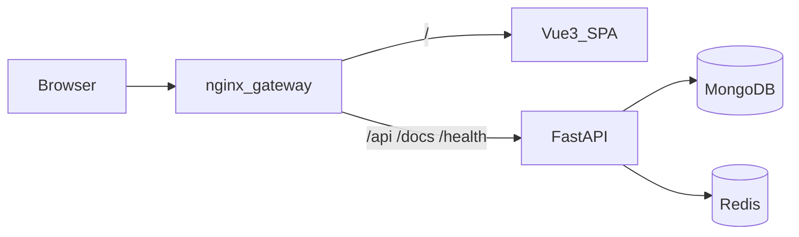

# QBIQ Dig Store — Mini E-Commerce Platform

Full-stack digital products shop with a **FastAPI** backend, **Vue 3** frontend, **MongoDB** persistence, **Redis** caching and cart sessions, and **Docker Compose** for local deployment.

## Architecture



- **Gateway** — nginx reverse proxy on port 80; routes `/` to the frontend and `/api`, `/docs`, `/health` to the backend
- **Products** — stored in MongoDB, auto-seeded from `backend/data/products.json`
- **Product cache** — Redis TTL cache for list/detail responses
- **Cart** — Redis session storage keyed by `X-Cart-Session-Id` header
- **Frontend** — Vue 3 + TypeScript + Pinia + PrimeVue (Aura/Sky theme)

## Prerequisites

| Tool | Version |
|------|---------|
| Node.js | 24+ |
| Python | 3.12+ |
| Docker & Docker Compose | v2+ |

## Pinned versions

| Component | Version |
|-----------|---------|
| MongoDB (Docker) | `mongo:8.0.4-noble` |
| Redis (Docker) | `redis:8.0.2-alpine` |
| nginx (Docker) | `nginx:1.28.0-alpine` |
| Python (backend image) | `3.12.8-slim-bookworm` |
| Node (frontend build) | `24.11.0-bookworm-slim` |
| FastAPI | `0.136.1` |
| Beanie | `2.1.0` |
| Vue | `3.5.40` |
| Vite | `8.2.0` |
| PrimeVue | `4.3.6` |

See [`backend/requirements.txt`](backend/requirements.txt) and [`frontend/package.json`](frontend/package.json) for the full dependency lists.

## Quick start (Docker Compose)

Run the full stack with one command:

```bash
docker compose up --build
```

| Service | URL |
|---------|-----|
| App (via gateway) | http://localhost |
| Backend API | http://localhost/api |
| Backend API (direct) | http://localhost:8000 |
| API docs (Swagger) | http://localhost/docs |
| Health check | http://localhost/health |

Stop and remove containers:

```bash
docker compose down
```

Remove persisted MongoDB data:

```bash
docker compose down -v
```

### Docker services

| Service | Image / build | Role |
|---------|---------------|------|
| `mongo` | `mongo:8.0.4-noble` | Product persistence |
| `redis` | `redis:8.0.2-alpine` | Cache + cart sessions |
| `backend` | [`backend/Dockerfile`](backend/Dockerfile) — Python 3.12, uvicorn | FastAPI API |
| `frontend` | [`frontend/Dockerfile`](frontend/Dockerfile) — multi-stage Node build → nginx | Static SPA (prod build) |
| `gateway` | `nginx:1.28.0-alpine` + [`deploy/nginx-gateway.conf`](deploy/nginx-gateway.conf) | Single entry point on port 80 |

### Dev override (hot reload)

For backend `--reload` and Vite dev server on port 5173:

```bash
docker compose -f docker-compose.yml -f docker-compose.dev.yml up --build
```

App: http://localhost (gateway) or http://localhost:5173 (Vite direct)

In dev mode:

- Backend mounts source with `--reload`
- Frontend runs Vite on 5173 with `VITE_API_BASE_URL=/api` so API calls go through the gateway (same-origin, no CORS issues)
- Gateway uses [`deploy/nginx-gateway.dev.conf`](deploy/nginx-gateway.dev.conf) to proxy to Vite instead of the built frontend

## Local development (without Docker)

### 1. Start MongoDB and Redis

```bash
docker run -d --name qbiq-dig-store-mongo -p 27017:27017 mongo:8.0.4-noble
docker run -d --name qbiq-dig-store-redis -p 6379:6379 redis:8.0.2-alpine
```

### 2. Backend

```bash
cd backend
cp .env.example .env
python3.12 -m venv .venv
source .venv/bin/activate
pip install -r requirements-dev.txt
uvicorn app.main:app --reload --port 8000
```

### 3. Frontend

```bash
cd frontend
cp .env.example .env
npm ci
npm run dev
```

App: http://localhost:5173

### Frontend npm scripts

| Script | Purpose |
|--------|---------|
| `npm run dev` | Vite dev server |
| `npm run build` | Production build |
| `npm run build:pages` | Pages-mode build + SPA fallback files |
| `npm run deploy:pages` | Build + copy to `docs/` |
| `npm test` | Vitest unit/a11y tests |

## GitHub Pages (frontend hosting)

The frontend can be deployed to **GitHub Pages** as a static SPA. When the backend is unreachable, the app automatically switches to **demo mode** (bundled product catalog + localStorage cart).

### One-time GitHub setup

1. Open **Settings → Pages** in the repo on GitHub
2. **Source:** Deploy from a branch
3. **Branch:** `main` / **`/docs`**
4. Save and wait 1–2 minutes

### Default behavior (demo mode)

The Pages build ([`frontend/.env.pages`](frontend/.env.pages)) sets `VITE_DEMO_FALLBACK=true`. On load, the app probes `/health`; if the API is unreachable, you see a **Demo mode** banner and can browse products, use the cart, and complete mock checkout — all client-side.

Live site: **https://xaracal.github.io/qbiq/**

### Optional: connect a live HTTPS API

Edit `frontend/.env.pages` before deploying:

| Variable | Purpose |
|----------|---------|
| `VITE_BASE_PATH` | `/qbiq/` for `https://xaracal.github.io/qbiq/` |
| `VITE_API_BASE_URL` | Full URL to your backend API (must be **HTTPS** on Pages) |
| `VITE_DEMO_FALLBACK` | `true` = fall back to demo data when API fails; `false` = errors only |

**Example with ngrok + local Docker backend:**

```bash
# Terminal 1: full stack
docker compose up --build

# Terminal 2: expose backend (port 8000) over HTTPS
ngrok http 8000
```

Set in `frontend/.env.pages`:

```env
VITE_API_BASE_URL=https://YOUR-NGROK-ID.ngrok-free.app/api
VITE_DEMO_FALLBACK=true
```

Add the ngrok origin to `CORS_ORIGINS` in [`docker-compose.yml`](docker-compose.yml), then rebuild and redeploy the frontend.

### Deploy to GitHub Pages (single `main` branch)

```bash
cd frontend
npm ci
npm run deploy:pages
git add docs/
git commit -m "chore: update GitHub Pages build"
git push origin main
```

This builds with `pages` mode, adds `404.html` + `.nojekyll`, and copies the output to [`docs/`](docs/) on `main`. GitHub Pages serves from that folder — no separate `gh-pages` branch.

> **Do not edit [`docs/`](docs/) manually.** It is regenerated by `npm run deploy:pages`. Commit the output after each deploy.

> **Tip:** Docker Compose at http://localhost is the simplest full-stack demo. GitHub Pages with default settings works standalone in demo mode without any backend.

## Network resilience

The frontend handles unreliable connections:

| Feature | Description |
|---------|-------------|
| Browser offline banner | Shown only when `navigator.onLine` is false |
| Demo mode banner | Shown when the API is unreachable but demo fallback is enabled |
| Reconnect banner | Confirms when connectivity returns and data refreshes |
| GET retries | Product reads retry up to 2 times with exponential backoff |
| Mutation retries | Cart/checkout requests retry once on network failure |
| Optimistic rollback | Cart UI reverts if an update fails after local changes |
| Auto-refresh | Cart and failed product lists reload when connection is restored |

## Accessibility

The frontend includes basic accessibility support:

| Feature | Description |
|---------|-------------|
| Skip-to-content link | Keyboard users can bypass navigation |
| ARIA labels | Cart controls, loading states, and interactive elements |
| Live regions | Cart totals and status messages announced to screen readers |
| Focus management | Focus moves appropriately on route changes |
| Tests | Vitest a11y checks in [`frontend/src/__tests__/`](frontend/src/__tests__/) |

## Running tests

### Backend

```bash
cd backend
source .venv/bin/activate
pip install -r requirements-dev.txt
pytest tests/ -v --ignore=tests/test_products_integration.py
```

Integration tests (require MongoDB):

```bash
pytest tests/test_products_integration.py -v
```

### Frontend

```bash
cd frontend
npm ci
npm test
```

## API reference

All cart and checkout endpoints require the `X-Cart-Session-Id` header (UUID generated by the frontend).

| Method | Path | Description |
|--------|------|-------------|
| `GET` | `/health` | MongoDB + Redis health |
| `GET` | `/api/products` | List products (see query params below) |
| `GET` | `/api/products/{id}` | Product detail with reviews |
| `GET` | `/api/cart` | Get cart |
| `POST` | `/api/cart/items` | Add item `{ productId, quantity }` |
| `PATCH` | `/api/cart/items/{id}` | Update quantity `{ quantity }` |
| `DELETE` | `/api/cart/items/{id}` | Remove item |
| `DELETE` | `/api/cart` | Clear cart without placing an order |
| `POST` | `/api/checkout` | Mock checkout — persist order, clear cart |
| `GET` | `/api/orders/{id}` | Get order (session must match) |

### `GET /api/products` query parameters

| Query param | Type | Values | Description |
|-------------|------|--------|-------------|
| `name` | string | — | Case-insensitive substring filter |
| `category` | string | — | Exact category match |
| `sort_by` | string | `price`, `name` | Sort field |
| `sort_order` | string | `asc`, `desc` | Default `asc` |

Request/response bodies are documented in Swagger at http://localhost/docs (via gateway) or http://localhost:8000/docs (direct).

## Environment variables

### Backend (`backend/.env`)

Copy from [`backend/.env.example`](backend/.env.example):

| Variable | Default | Description |
|----------|---------|-------------|
| `MONGODB_URL` | `mongodb://localhost:27017` | MongoDB connection string |
| `MONGODB_DB_NAME` | `qbiq_dig_store` | Database name |
| `REDIS_URL` | `redis://localhost:6379` | Redis connection string |
| `CACHE_TTL_SECONDS` | `300` | Product cache TTL |
| `CART_SESSION_TTL_SECONDS` | `86400` | Cart session TTL (24h) |
| `CORS_ORIGINS` | see `config.py` | JSON list of allowed origins |

### Frontend

| File | Use |
|------|-----|
| `frontend/.env` | Local dev (`npm run dev`) |
| `frontend/.env.pages` | GitHub Pages build (`npm run build:pages`) |

| Variable | Default | Description |
|----------|---------|-------------|
| `VITE_API_BASE_URL` | `http://localhost:8000/api` (local) or `/api` (Docker dev) | Backend API base URL |
| `VITE_BASE_PATH` | `/` (dev) or `/qbiq/` (Pages) | Vite public base path |
| `VITE_DEMO_FALLBACK` | unset (dev) or `true` (Pages) | Use bundled demo data when API is unreachable |

## Project structure

```
qbiq-dig-store/
├── backend/
│   ├── app/                 # FastAPI routes, services, models
│   ├── data/                # products.json seed data
│   └── tests/
├── docs/                    # GENERATED — GitHub Pages output (do not edit)
├── frontend/
│   ├── src/                 # Vue pages, stores, API clients
│   └── scripts/             # prepare-pages.mjs, publish-docs.mjs
├── deploy/                  # nginx gateway configs (prod + dev)
├── docker-compose.yml       # Full stack (mongo, redis, backend, frontend, gateway)
├── docker-compose.dev.yml   # Hot-reload override
└── README.md
```

## License

Private — home assignment project.
